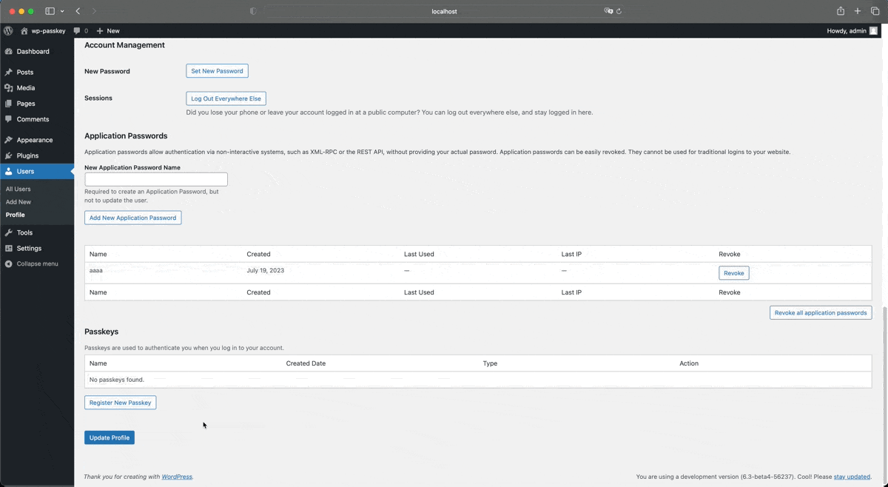
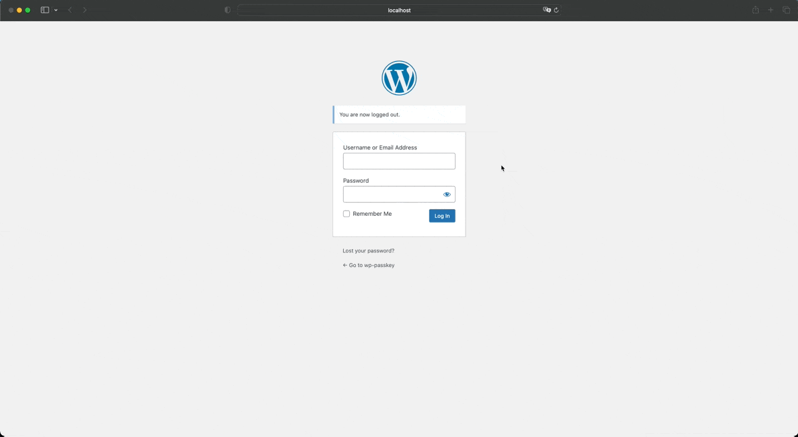

# Biometric Authentication - Login with Passkey

## Introduction

This plugin is to enable the use of [Passkeys](https://developers.google.com/identity/passkeys#introduction) on WordPress. This will provide an alternative to the traditional username and password login for users and on top of that it will provide a more secure way to login to the WordPress site.

> Passkeys are a safer and easier alternative to passwords. With passkeys, users can sign in to apps and websites with a biometric sensor (such as a fingerprint or facial recognition), PIN, or pattern, freeing them from having to remember and manage passwords.

Source and Read more about Passkeys: [Google Developers](https://developers.google.com/identity/passkeys#introduction)

## Description

Passkeys are a safer and easier alternative to passwords. Simply use your fingerprint or face ID to log in with ease.

This innovative plugin introduces passkey login to your WordPress experience. No more struggling to remember complex passwords.
Simply use your fingerprint, face ID, or a secure PIN to log in with ease. You can still use your username and password to login to your site as fallback.

### Enhanced Security, Frictionless Access

1. Effortless Login: Unlock the power of passkeys for a smooth and secure login experience.
2. Superior Security: Passkeys offer enhanced protection against breaches compared to traditional passwords.
3. Convenience at Your Fingertips: Enjoy the freedom of logging in with your biometrics or a secure PIN.

## Screenshots

### Passkey Registration



### Login with Passkey



## Installation

1. Upload the plugin files to the `/wp-content/plugins/biometric-authentication` directory, or install the plugin through the WordPress plugins screen directly.
2. Activate the plugin through the 'Plugins' screen in WordPress
3. To create your first passkey, you can go to your Admin > Profile screen.
4. Now you can login with your passkey.

## Local Development

Local Development uses the [@wordpress/env](https://developer.wordpress.org/block-editor/reference-guides/packages/packages-env/) environment.

> `wp-env`` lets you easily set up a local WordPress environment for building and testing plugins and themes. It’s simple to install and requires no configuration.

### Prerequisites

You need certain pieces of software on your computer before setting up this project locally.

- [Composer](https://getcomposer.org/) for installing PHP dependencies
- [Node](https://nodejs.org/en/) for installing JavaScript dependencies
- [Docker](https://docs.docker.com/get-docker/) for running the local server environment

Whilst newer versions of the above packages may be available, the versions of the these the team is predominately running are:

- PHP v8.1.x or above
- Composer v2.x
- Node.js v16.x
- npm v7.x
- Docker v20.x

### Installation

To set up this repository for local development, clone it down onto your computer and run the following steps to install Composer and npm dependencies.

```bash
git clone git@github.com:ivankristianto/wp-passkey.git biometric-authentication
cd biometric-authentication
composer install
npm install
npm run build

npm run server start
```

Once you run `npm run server start`, Docker will pull down the docker image and set up your development environment. This may take a few minutes to complete.

**Your site should now be running at [localhost:8888](http://localhost:8888/)!**

### Development Build

To build the plugin for development, run the following command:

```bash
npm run dev
```

This will run Vite in development mode and watch for any changes to the files in the `src` directory. Hot module replacement is enabled by default. The built files will be placed in the `assets/dist` directory.

### Lint and Unit Tests

To run the lint, run the following command:

```bash
npm run lint
```

To run the unit tests, run the following command:

```bash
npm run test-unit-php
```

### Run WP-CLI

To run WP-CLI, run the following command:

```bash
npm run cli wp <commands>

#sample
npm run cli wp option get siteurl
```

## Local Development with GitHub Codespace

You can also use GitHub Codespace to develop this plugin. To do so, you can follow the steps below:

1. From GitHub repo screen
2. Click on the `Code` button
3. Click on the `Create codespace on main` button
4. Wait until the Codespace is ready

This will setup the codespace dev environment for you and setup all the dependencies.
Once the Codespace is ready, you can run the visit the url provided by GitHub Codespace terminal to access the site.

## Contributing

If you would like to contribute to this plugin, please fork the repository and submit a pull request.

## Changelog

### 0.3.8

- Update plugin description

### 0.3.1

- Update plugin name
- Update dependencies
- Fix code standards

### 0.2.1

- Fix release GitHub action.

### 0.2.0

- Allow user to revoke passkey.
- Add name & created date as extra data for passkey entity.
- Fix name override when signing in with passkey.

### 0.1.0

- Initial release.
